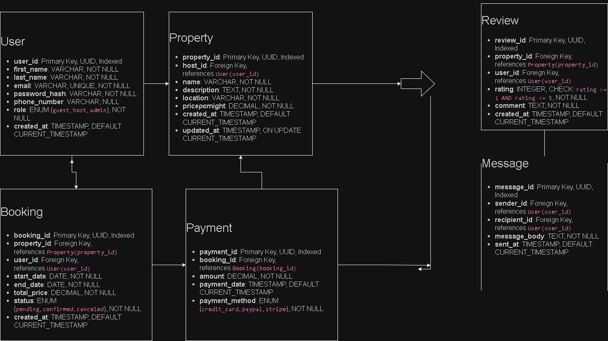

# ER Diagram for AirBnB Database

This ER diagram visualizes the main structure of the AirBnB database system.

## Entities:
- **User**
- **Property**
- **Booking**
- **Payment**
- **Review**
- **Message**

## Relationships:
- A **User** can have multiple **Bookings**
- A **Host (User)** can list multiple **Properties**
- A **Property** can have multiple **Bookings** and **Reviews**
- A **Booking** has one **Payment**
- **Users** can send and receive **Messages**

